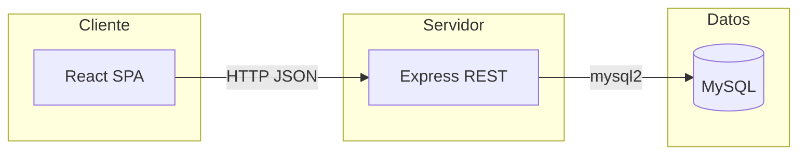

# Diseño de la solución

Este documento describe el diseño técnico alineado con la narrativa ([`NARRATIVA_PROBLEMA.md`](./NARRATIVA_PROBLEMA.md)) y los requerimientos ([`REQUERIMIENTOS_FUNCIONALES_Y_NO_FUNCIONALES.md`](./REQUERIMIENTOS_FUNCIONALES_Y_NO_FUNCIONALES.md)).

---

## 1. Visión general

La solución sigue una **arquitectura cliente-servidor** en tres capas lógicas:

- **Presentación:** aplicación React que consume la API.
- **Aplicación / API:** Node.js con Express, validaciones y mapeo HTTP ↔ SQL.
- **Datos:** MySQL, esquema relacional normalizado para la entidad docente.

---

## 2. Modelo de datos

### 2.1 Entidad principal: `docentes`

| Campo | Tipo (referencia) | Descripción |
|-------|-------------------|-------------|
| `id` | INT, PK, autoincremental | Identificador único (RF-10). |
| `nombre` | VARCHAR | Nombre completo. |
| `correo` | VARCHAR | Correo institucional. |
| `telefono` | VARCHAR | Contacto. |
| `titulo` | VARCHAR | Título académico máximo. |
| `area_academica` | VARCHAR | Disciplina o programa. |
| `dedicacion` | VARCHAR | TC, medio tiempo, cátedra, etc. |
| `anios_experiencia` | INT, ≥ 0 | Años de experiencia docente. |
| `created_at` | TIMESTAMP | Auditoría mínima de alta (opcional en formularios). |

El script de creación puede vivir en `docs/sql/schema_docentes.sql` y debe mantenerse **sincronizado** con los campos que usa la API.

### 2.2 Restricciones

- NOT NULL en columnas de negocio obligatorias (coherente con RF-06 en capa BD).
- PK en `id` para integridad referencial futura.

---

## 3. API REST

**Base URL (desarrollo):** `http://localhost:3001` (ajustable por variable de entorno).

| Método | Ruta | Descripción | Códigos típicos |
|--------|------|-------------|-----------------|
| GET | `/docentes` | Lista todos los docentes (RF-02). | 200, 500 |
| GET | `/docentes/:id` | Detalle por ID (RF-03). | 200, 404, 500 |
| POST | `/docentes` | Alta (RF-01, RF-06, RF-07, RF-08). | 201, 400, 500 |
| PUT | `/docentes/:id` | Actualización (RF-04, RF-08). | 200, 400, 404, 500 |
| DELETE | `/docentes/:id` | Baja (RF-05). | 200, 404, 500 |

### 3.1 Contrato JSON (cuerpo POST/PUT)

Campos en el cuerpo: `nombre`, `correo`, `telefono`, `titulo`, `area_academica`, `dedicacion`, `anios_experiencia`.  
Respuestas de error: objeto JSON con clave `error` y mensaje descriptivo (RNF-05).

### 3.2 Seguridad de consultas

Uso de **placeholders** (`?`) y arrays de parámetros en todas las sentencias dinámicas (RNF-03).

### 3.3 CORS

Middleware que permita el origen del frontend en desarrollo (RNF-04).

---

## 4. Capa de servidor (Node / Express)

- **Punto de entrada:** módulo principal que registra middleware global (`express.json`, `cors`) y rutas.
- **Acceso a datos:** módulo de conexión reutilizado por las rutas. En **este repositorio** los valores de conexión se leen desde **`server/.env`** (`DB_HOST`, `DB_USER`, `DB_PASSWORD`, `DB_NAME`) mediante **dotenv** en `server/db.js`; no subas `.env` con contraseñas reales a repositorios públicos.
- **Validación:** antes de INSERT/UPDATE, comprobar campos requeridos y `anios_experiencia` numérico no negativo; responder 400 si falla.

---

## 5. Capa de cliente (React)

- **Listado:** tabla o lista que consume `GET /docentes`.
- **Alta / edición:** formulario que envía `POST` o `PUT` según modo.
- **Baja:** confirmación y llamada a `DELETE /docentes/:id`.
- **Manejo de errores:** mostrar mensajes devueltos por la API cuando existan.

La URL base de la API puede centralizarse en una constante o variable de entorno del build (Vite/React) para distintos entornos.

---

## 6. Despliegue y configuración (laboratorio)

1. Crear base y tabla ejecutando el script SQL (`docs/sql/schema_docentes.sql`).
2. Ajustar usuario, contraseña y base en **`server/.env`** (coherente con `server/db.js`).
3. En `server/`: `npm install`, luego `npm start` (o `npm run dev` con nodemon).
4. En `client/`: `npm install`, luego `npm start`, en paralelo con la API (puerto distinto: 3000 vs 3001).

Los pasos detallados para quien no conozca npm están en [TUTORIAL_CRUD_DOCENTES.md](./TUTORIAL_CRUD_DOCENTES.md).

---

## 7. Matriz requerimiento → diseño

| Requerimiento | Elemento de diseño |
|---------------|-------------------|
| RF-01–RF-05 | Rutas REST y operaciones SQL CRUD |
| RF-06–RF-08 | Validación en Express + restricciones BD |
| RF-09 | Pantallas React descritas en §5 |
| RF-10 | `id` autoincremental en MySQL |
| RNF-01 | JSON + verbos HTTP estándar |
| RNF-02 | MySQL + esquema §2 |
| RNF-03 | Consultas parametrizadas |
| RNF-04 | `cors()` en Express |
| RNF-05 | `status()` y cuerpos de error JSON |
| RNF-07 | Separación API / DB / UI |

---

*Este diseño corresponde al repositorio de referencia `crud-node-react-sql` y puede ampliarse con autenticación, paginación y soft-delete sin contradecir la narrativa original.*
